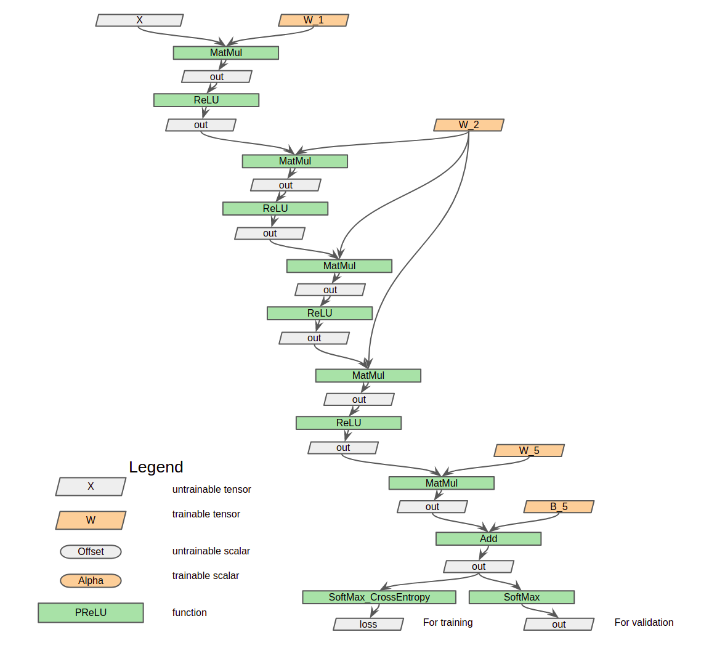

# Fully connected neural network of shared weight example

## I. Architecture of this neural network

This is a fully connected network applying a weight shared by multiple layers. As what the following image shows, ***W_2*** is shared by three FC layers.



## II. How to build and run this program 

### **Step 1: Create build dir, and go into this dir**

```sh
mkdir build
cd build

```

### **Step 2: Execute the following commands to build:**

- Debug mode :

```sh
cmake -DCMAKE_BUILD_TYPE=Debug ../
```

- Release mode:

```sh
cmake -DCMAKE_BUILD_TYPE=Release ../
```

- To build on AARCH64 platform

```sh
cmake -DARCH_ARM=ON -DCMAKE_BUILD_TYPE=Debug ../
```

or

```sh
cmake -DARCH_ARM=ON -DCMAKE_BUILD_TYPE=Release ../
```

- If you want to add OpenBLAS dependency to speed up calculations on CPU, you can turn OpenBLAS on.

```sh
cmake -DWITH_OPENBLAS=ON -DCMAKE_BUILD_TYPE=Debug ../
```

or

```sh
cmake -DWITH_OPENBLAS=ON -DCMAKE_BUILD_TYPE=Release ../
```

- If you want to add OneDNN dependency to continue to boost deep learning on Intel CPU, you can turn OneDNN (MKL) on.

```sh
cmake -DWITH_OPENBLAS=ON -DWITH_ONEDNN=ON -DCMAKE_BUILD_TYPE=Debug ../
```

or

```sh
cmake -DWITH_OPENBLAS=ON -DWITH_ONEDNN=ON -DCMAKE_BUILD_TYPE=Release ../
```

- Do not forget to turn CUDA option ON if you want to boost your program with CUDA. The ***Julie Neurons*** library which this program depends on should be built with `WITH_CUDA` turned on as well.

```sh
cmake -DWITH_CUDA=ON -DCMAKE_BUILD_TYPE=Debug ../
```

or

```sh
cmake -DWITH_CUDA=ON -DCMAKE_BUILD_TYPE=Release ../
```

- If you want to continue to boost deep learning with NVIDIA GPU card, you should turn cuDNN on.

```sh
cmake -DWITH_CUDA=ON -DWITH_CUDNN=ON -DCMAKE_BUILD_TYPE=Debug ../
```

or

```sh
cmake -DWITH_CUDA=ON -DWITH_CUDNN=ON -DCMAKE_BUILD_TYPE=Release ../
```

### **Step 3: Execute `make` command to build this library:**

```sh
make
```

You can speed up the build if you specify number of jobs to run.
For example:


```
make -j8
```

### **Step 4: Run this program**

Step3 generates an executable file. Run the executable file with location of MNIST dataset provided.

```
./fc_shared_w_demo <Path_of_the_MNIST_dataset>
```

For example:

```
./fc_shared_w_demo ../../../dataset/mnist/
```
