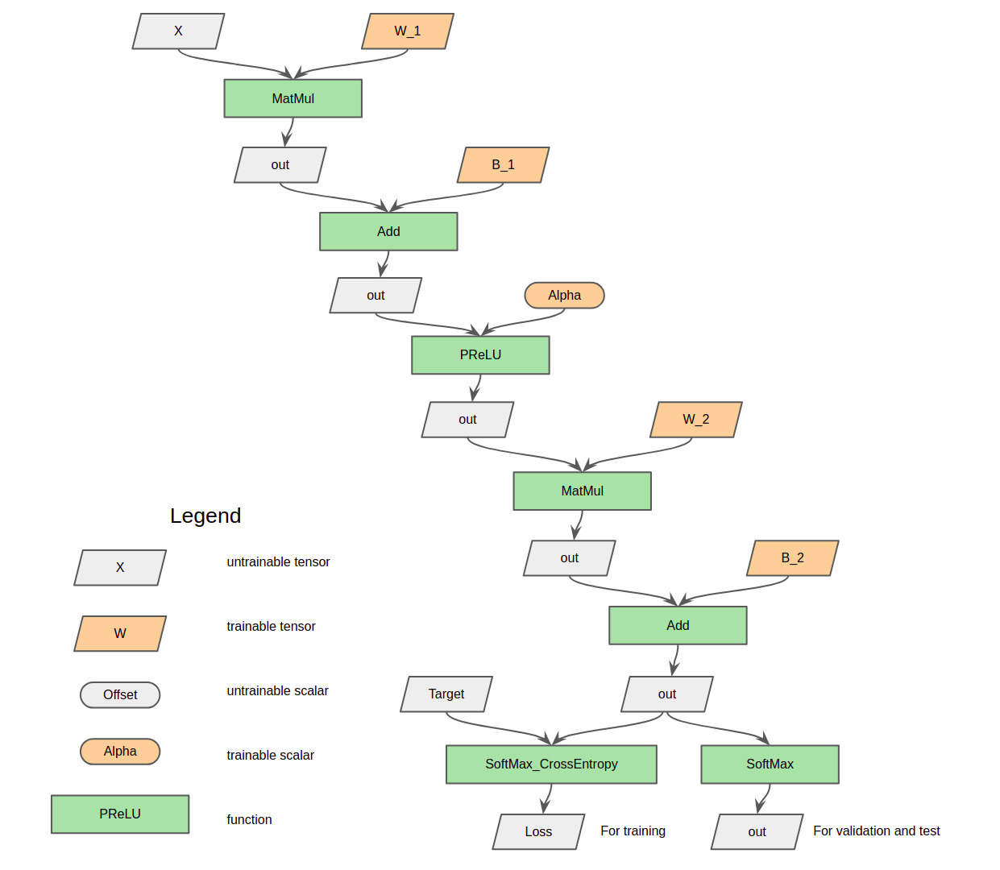
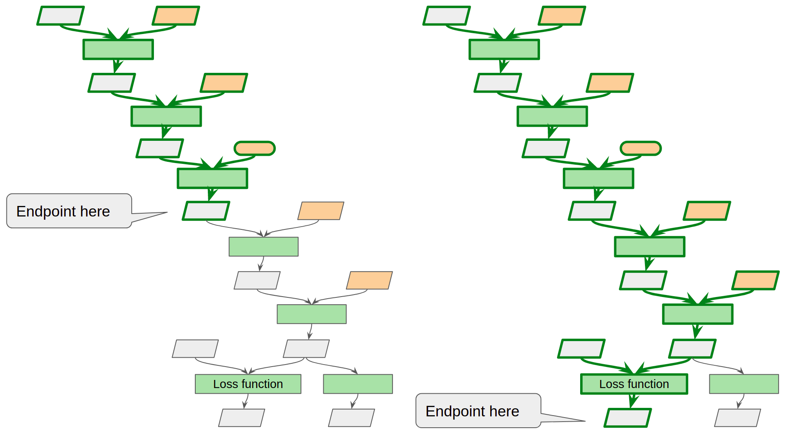
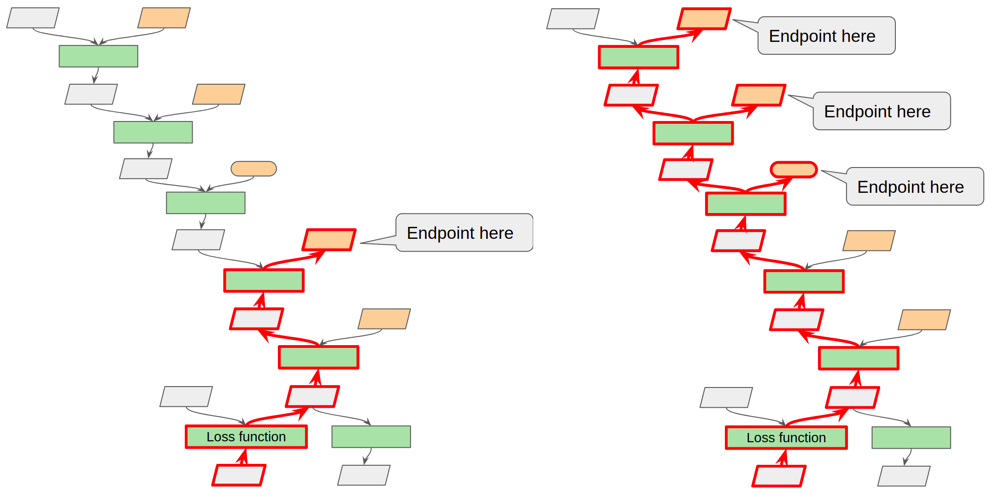

# Julie Neurons Deep Learning Frameworks
## I. Structure of this library

```
├── README.md         README document
├── CMakeLists.txt    CMake configuration
├── readme_images/    Figures for the README document
├── build/            Compile & build job is done here
└── julie/            Root entry of Julie Neurons source code
     ├── la/          Basic linear algebra calculations are implemented here
     │    ├── cpu/
     │    └── cuda/
     ├── nn/          Implementation of neural architecture including operators (functions), variables and optimizers
     │    ├── func/
     │    ├── opt/
     │    └── var/
     └── op/          Mechanics of neural network architecture is implemented here (forward and backward propagation)
```
### **Introduction of library directories one by one**

- ***julie*** directory

    Root directory of ***Julie Neurons*** source code

- ***la*** directory

    ***la*** stands for *Linear Algebra*. This directory includes all basic mathematical implementations for Deep Learning here. You can add ***-DWITH_ONEDNN=ON*** option or ***-DWITH_CUDNN=ON*** option to compilation of ***Julie Neurons*** to make arithmetic operations oneDNN (MKL) or cuDNN dependent respectively.

- ***cpu*** directory

    This directory stores C++ source code of basic mathematical implementations running on CPU. Matrix multiplication in this directory will depend on OpenBLAS library if you add ***-DWITH_OPENBLAS=ON*** option to compilation of ***Julie Neurons***.

- ***cuda*** directory

    This directory includes C++ and CUDA source code of basic mathematical implementations running on nvidia GPU. Following requirements should meet if you would like to include source code in this directory into compilation:

    1. The GPU should satisfy at least version 5.3 computing capacity

    2. CUDA driver/runtime or toolkit higher than 8.0

    3. Add ***-DWITH_CUDA=ON*** option while building ***Julie Neurons*** library.

- ***nn*** directory

    ***nn*** abbreviates *Neural Network*. This directory stores implementations of the neural architecture such as function nodes, tensors, scalars and optimizers.

- ***func*** directory

    This directory includes implementations of function nodes like *MatMul*, *Conv2d*, *ReLU*, *Sigmoid*, etc.

- ***opt*** directory

    This directory includes implementations of neural net optimizers.
 
- ***var*** directory

    This directory has implementations of neural net variables. There are 2 kinds of variables: Tensors and scalars.

- ***op*** directory

    ***op*** stands for *operations*. This directory stores base definitions for the neural network skeleton: functions and variables that construct a neural net graph.

## II. How a neural network is constructed

### What is a ***Matrix***?

A matrix stores a piece of data that may include multiple integer or float-point numbers. Each matrix has a shape, and could be multi-dimensional. For example, a float-point matrix of shape (8, 20, 16) is a three dimensional matrix including 8 * 20 * 16 = 2560 float-point numbers. Operations can be done to matrices so that they can be reshaped, transposed, added, mutiplied, scaled, etc.

### ***Tensors***, ***Scalars*** and ***Functions***

- Tensors and scalars are called variables in a neural network graph. Variable are classified into trainable variables and untrainable variables.

- A variable can be assigned by a value or a gradient. A tensor's value or gradient is a matrix, while a scalar's value or gradient is a singular integer or float-point number.

- A variable's value or gradient could be a NULL pointer when the network graph is newly constructed. Forward or back-propagation will fillin these NULL pointers with matrices or singular numbers.

- Functions are operational graph nodes. Forward operation of a function receives values from input variables and provide value for the output variable. Conversely, backward operation of a function accepts gradient from the output variable and then figure out gradients for input variables.

### Neural network example

Using this library, a 2-layered fully connected neural network can be constructed with ***tensors***, ***scalars*** and ***functions*** as what the following picture shows. You can refer to implementation of this fully connected neural network example in `../demo/fully_connected` for more source code details.



## III. How a neural network is trained and validated

A neural network can be trained and validated by forward-propagation, back-propagation and optimization (SGD, etc).

### ***Graph::forward*** API

You should call `Graph::forward()` with a variable specified as an endpoint. In the following picture, variables and functions in green color are visited and called when `Graph::forward()` is executed.

Especially, loss function's output is commonly specified as endpoint of `Graph::forward()` in training tasks; while in validation tasks outputs of other functions are used as endpoints.

You can specify multiple endpoints by calling `Graph::forward()` multiple times with a different endpoint each time.



### ***Graph::clear_forwards*** API

If you want to re-run the forward job, you have to make all graph nodes unvisited by executing `Graph::clear_forwards()`.

### ***Graph::backward*** API

Similarly, `Graph::backward()` should be called with an endpoint so that nodes and edges in red color can be back-propagated. You can specify multiple endpoints by calling `Graph::backward()` multiple times using a different endpoint each time.

Endpoints of `Graph::backward()` are usually trainable variables (weights). Trainable variables (weights) are often selective in training jobs due to special project requirements, which means not all trainable variables are needed to be trained in some cases. However, you can call `Graph::backward()` without specifying any endpoints, and then all trainable variables (weights) will be trained in network optimization.

The following picture shows how back-propagation works when one or multiple trainable variables are selected as endpoints.



### ***Graph::clear_backwards*** API

The API `Graph::clear_backwards()` is needed if you want to re-do `Graph::backward()`.

### ***Optimizer::step*** API

An optimizer can be constructed binding with a network graph. And then you can update trainable variables (weights) by using `Optimizer::step()` each time `Graph::backward()` is called. Only trainable variables specified as endpoints of `Graph::backward()` can be trained.

Until now there is only one type of optimizer available: SGD (Stochastic Gradient Descent) with momentum. Other types of optimizers are still under development.

## IV. How to compile and build this library

### Available build options for **OPENBLAS, ONEDNN, CUDA** and **CUDNN**:

| Platform | CMAKE_BUILD_TYPE | ARCH_ARM (arm cpu or not) | WITH_OPENBLAS (openBLAS) | WITH_ONEDNN (oneDNN) | WITH_CUDA (CUDA + cuBLAS) | WITH_CUDNN (cuDNN)|
| ---                    | ---              | ---       | ---       | ---       | ---       | ---       |
| x86 CPU + NVIDIA GPU   | Debug or Release |       OFF | ON or OFF | ON or OFF | ON or OFF | ON (depends on CUDA) or OFF |
| x86 CPU                | Debug or Release |       OFF | ON or OFF | ON or OFF |       OFF |       OFF |
| ARM CPU + NVIDIA GPU   | Debug or Release | ON        | ON or OFF |       OFF | ON or OFF | ON (depends on CUDA) or OFF |
| ARM CPU                | Debug or Release | ON        | ON or OFF |       OFF |       OFF |       OFF |

### **Step 1: Create *build* directory, and go into this *build* directory**

```sh
mkdir build
cd build
```

### **Step 2: Execute the CMake command**

**Examples of CMake the command:**

- To build in debug mode :

```sh
cmake -DCMAKE_BUILD_TYPE=Debug ../
```

- To build in release mode:

```sh
cmake -DCMAKE_BUILD_TYPE=Release ../
```

- To build on AARCH64 platform

```sh
cmake -DARCH_ARM=ON -DCMAKE_BUILD_TYPE=Debug ../
```

or

```sh
cmake -DARCH_ARM=ON -DCMAKE_BUILD_TYPE=Release ../
```

- If you want to add OpenBLAS dependency to speed up calculations on CPU, you can turn OpenBLAS on.

```sh
cmake -DWITH_OPENBLAS=ON -DCMAKE_BUILD_TYPE=Debug ../
```

or

```sh
cmake -DWITH_OPENBLAS=ON -DCMAKE_BUILD_TYPE=Release ../
```

- If you want to add oneDNN dependency to continue to boost deep learning on Intel CPU, you can turn oneDNN (MKL) on.

```sh
cmake -DWITH_OPENBLAS=ON -DWITH_ONEDNN=ON -DCMAKE_BUILD_TYPE=Debug ../
```

or

```sh
cmake -DWITH_OPENBLAS=ON -DWITH_ONEDNN=ON -DCMAKE_BUILD_TYPE=Release ../
```

- If you want to speed up calculations with your NVIDIA GPU card, you should add an extra option named **WITH_CUDA** and turn it on.

```sh
cmake -DWITH_CUDA=ON -DCMAKE_BUILD_TYPE=Debug ../
```

or

```sh
cmake -DWITH_CUDA=ON -DCMAKE_BUILD_TYPE=Release ../
```

- If you want to continue to boost deep learning with NVIDIA GPU card, you should turn cuDNN on.

```sh
cmake -DWITH_CUDA=ON -DWITH_CUDNN=ON -DCMAKE_BUILD_TYPE=Debug ../
```

or

```sh
cmake -DWITH_CUDA=ON -DWITH_CUDNN=ON -DCMAKE_BUILD_TYPE=Release ../
```

### **Step 3: Execute `make` command to build this library:**

```sh
make
```

You can speed up the build if you specify number of jobs to run.
For example:

```
make -j8
```
